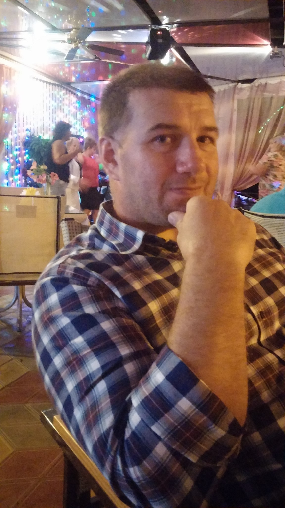

# Butenko Sergei

 
---
## Contacts
discord: sergei404

email: kvakazuabr@yandex.ru

telegram: sergei7001

## Summary

I like programming. It is fascinating and interesting. My goal is to learn a pure JavaScript at a good level and learn the React library. I will be glad to join the creation of open source projects. I would like to work under the guidance of an experienced developer to gain practical experience.

## Skills

Html, css, js, react, git, vscode

## Code

```
function solution(string) {
   return string.split('').map(el => {
        if (el === el.toUpperCase()) {
          return ' ' + el
        }
        return el
      }).join('')
}
```

## Experience

There is no experience as such, there are training, pet projects and tests.

## Education

rgsu
htmlacademy
stepic
udemy
youtube

## English

A1